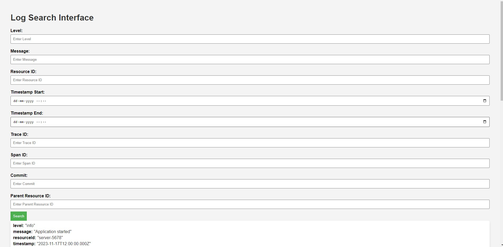
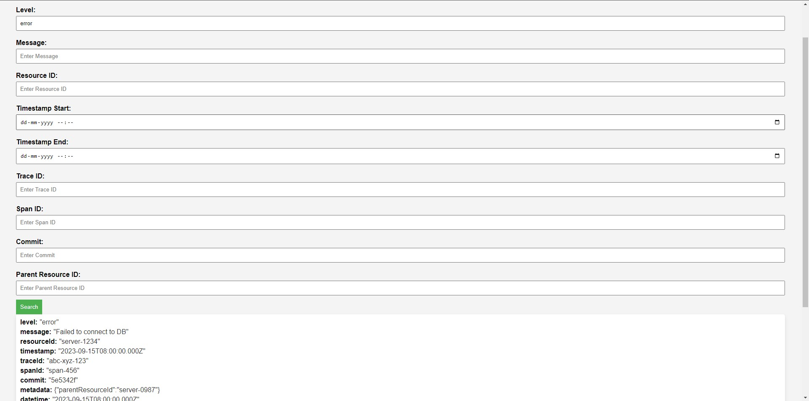

<div align="center">
  <a href="https://github.com/othneildrew/Best-README-Template">
<!--      -->
  </a>

  <h3 align="center">Log Ingestor and Query Interface</h3>
  </p>
</div>

<!-- TABLE OF CONTENTS -->
<details>
  <summary>Table of Contents</summary>
  <ol>
    <li>
      <!-- <a href="#about-the-project">About The Project</a> -->
        <a href="#built-with">Built With</a>
    </li>
    <li>
      <a href="#getting-started">Getting Started</a>
      <ul>
        <li><a href="#prerequisites">Prerequisites</a></li>
<!--         <li><a href="#installation">Installation</a></li> -->
      </ul>
    </li>
    <li><a href="#usage">Usage</a></li>
<!--     <li><a href="#roadmap">Roadmap</a></li> -->
<!--     <li><a href="#contributing">Contributing</a></li> -->
    <li><a href="#license">License</a></li>
<!--     <li><a href="#contact">Contact</a></li> -->
<!--     <li><a href="#acknowledgments">Acknowledgments</a></li> -->
  </ol>
</details>

<!-- ABOUT THE PROJECT -->

### Built With

- Node.js
- Express.js
- MongoDB
- Frontend: HTML, CSS, JavaScript

<p align="right">(<a href="#readme-top">back to top</a>)</p>

<!-- GETTING STARTED -->

## Getting Started

To get a local copy up and running follow these simple example steps.

### Prerequisites

First Clone the repository: -

- Git Bash
  ```sh
  git clone {Git Repository Link}
  ```
  Then navigate inside the folder and run npm install
- npm
  ```sh
  npm install
  ```

### Run the App

1. To run the app just open a terminal and use the following command: -

   ```sh
   node app.js
   ```

2. You can populate the backend with logs using the provided the ingest_logs.ps1 file. To do this, simply open git bash and run the following command: -
   ```sh
   powershell -ExecutionPolicy RemoteSigned -File ingest_logs.ps1
   ```
3. Run the query interface: While the app.js is running, open the index.html and the query interface should run
   ```sh
   Double click the index.html
   ```

<p align="right">(<a href="#readme-top">back to top</a>)</p>

<!-- USAGE EXAMPLES -->

## Usage

The Query Interface serves as a user-friendly portal for searching and retrieving specific log entries within the Log Ingestor system. Users can input search criteria such as log level, message content, resource ID, timestamp, trace ID, span ID, commit, and metadata (parent resource ID). The interface efficiently processes these queries and provides a streamlined display of matching log entries, allowing users to quickly assess and analyze relevant information.

Log search interface example
</br>

Log search interface when searching

<p align="right">(<a href="#readme-top">back to top</a>)</p>

<!-- LICENSE -->

## License

Distributed under the MIT License. See `LICENSE.txt` for more information.

<p align="right">(<a href="#readme-top">back to top</a>)</p>

<!-- MARKDOWN LINKS & IMAGES -->
<!-- https://www.markdownguide.org/basic-syntax/#reference-style-links -->

[contributors-shield]: https://img.shields.io/github/contributors/othneildrew/Best-README-Template.svg?style=for-the-badge
[contributors-url]: https://github.com/othneildrew/Best-README-Template/graphs/contributors
[forks-shield]: https://img.shields.io/github/forks/othneildrew/Best-README-Template.svg?style=for-the-badge
[forks-url]: https://github.com/othneildrew/Best-README-Template/network/members
[stars-shield]: https://img.shields.io/github/stars/othneildrew/Best-README-Template.svg?style=for-the-badge
[stars-url]: https://github.com/othneildrew/Best-README-Template/stargazers
[issues-shield]: https://img.shields.io/github/issues/othneildrew/Best-README-Template.svg?style=for-the-badge
[issues-url]: https://github.com/othneildrew/Best-README-Template/issues
[license-shield]: https://img.shields.io/github/license/othneildrew/Best-README-Template.svg?style=for-the-badge
[license-url]: https://github.com/othneildrew/Best-README-Template/blob/master/LICENSE.txt
[linkedin-shield]: https://img.shields.io/badge/-LinkedIn-black.svg?style=for-the-badge&logo=linkedin&colorB=555
[linkedin-url]: https://linkedin.com/in/othneildrew
[product-screenshot]: images/screenshot.png
[Next.js]: https://img.shields.io/badge/node.js-000000?style=for-the-badge&logo=nextdotjs&logoColor=white
[Next-url]: https://nodejs.org/
[React.js]: https://img.shields.io/badge/express.js-20232A?style=for-the-badge&logo=react&logoColor=61DAFB
[React-url]: https://expressjs.com/
[Vue.js]: https://img.shields.io/badge/mongodb-35495E?style=for-the-badge&logo=vuedotjs&logoColor=4FC08D
[Vue-url]: https://mongodb.com/
[Angular.io]: https://img.shields.io/badge/Angular-DD0031?style=for-the-badge&logo=angular&logoColor=white
[Angular-url]: https://angular.io/
[Svelte.dev]: https://img.shields.io/badge/Svelte-4A4A55?style=for-the-badge&logo=svelte&logoColor=FF3E00
[Svelte-url]: https://svelte.dev/
[Laravel.com]: https://img.shields.io/badge/Laravel-FF2D20?style=for-the-badge&logo=laravel&logoColor=white
[Laravel-url]: https://laravel.com
[Bootstrap.com]: https://img.shields.io/badge/Bootstrap-563D7C?style=for-the-badge&logo=bootstrap&logoColor=white
[Bootstrap-url]: https://getbootstrap.com
[JQuery.com]: https://img.shields.io/badge/jQuery-0769AD?style=for-the-badge&logo=jquery&logoColor=white
[JQuery-url]: https://jquery.com
# log_ingestor
# log_ingestor
